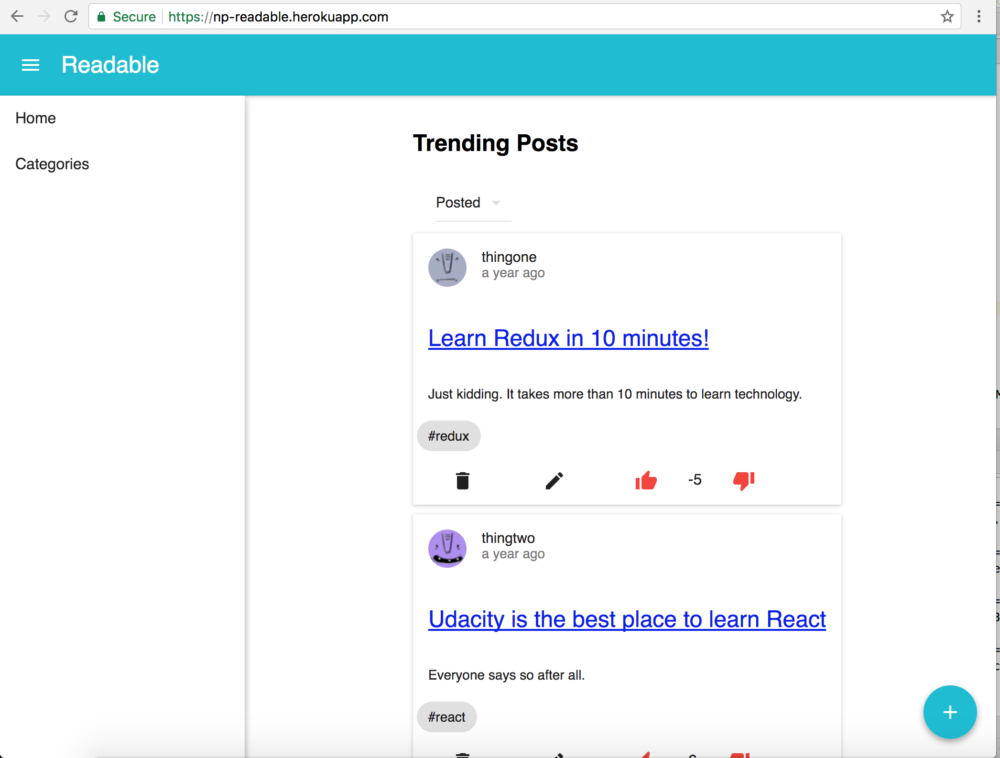
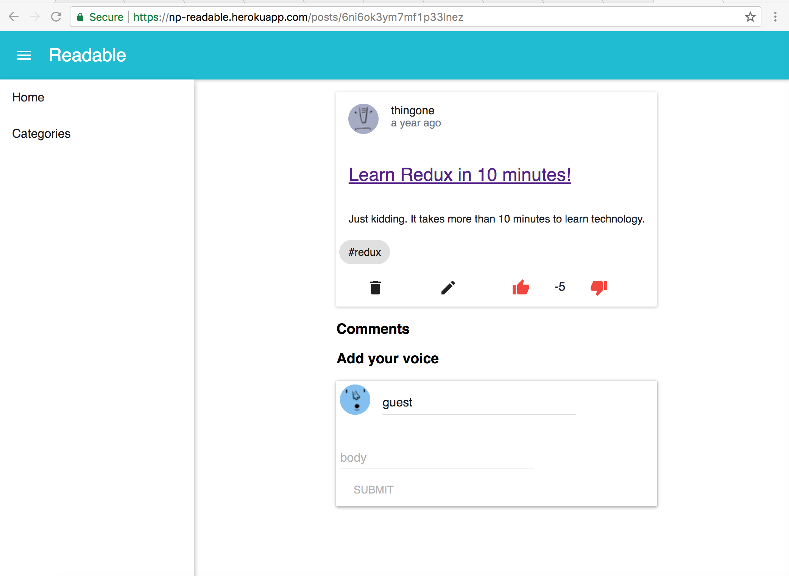
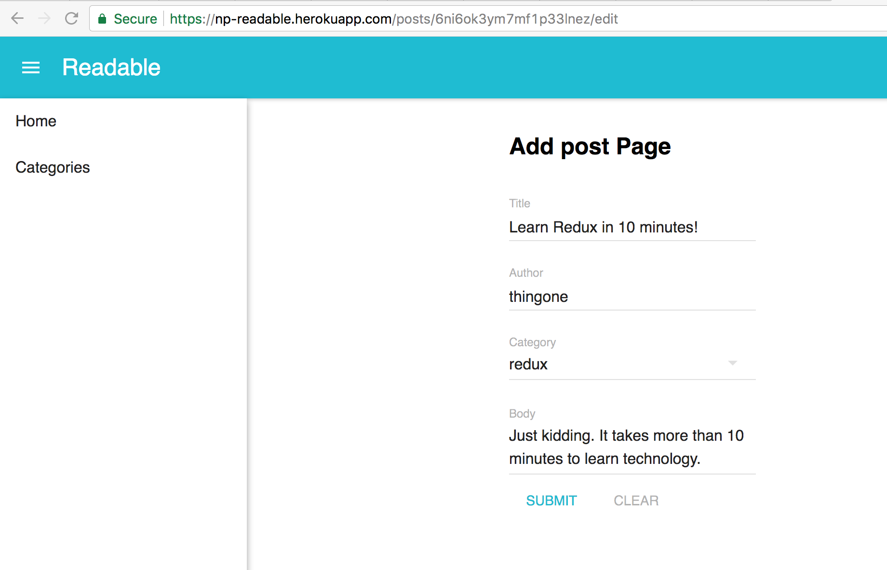
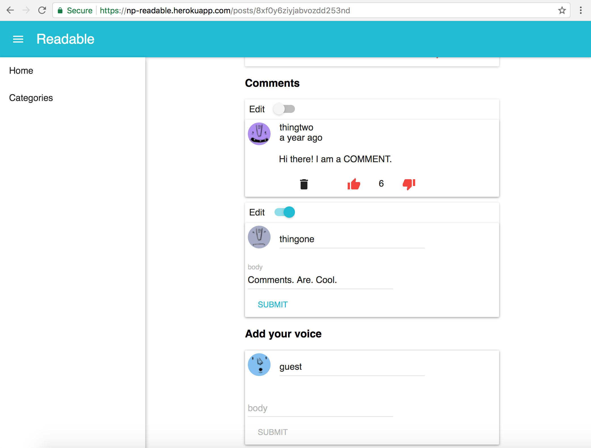
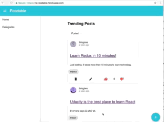
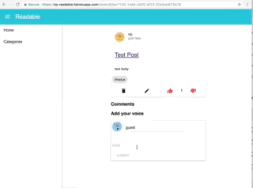
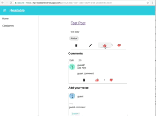

# Readable App Project
This is Udacity React project by Nidhin Pattaniyil. 

App Deployed on Heroku [here](https://np-readable.herokuapp.com)

## Installation

### Readable API Server
```
cd api-server
yarn
node server //launch server
```

### Readable Client
```
cd frontend
yarn
yarn run start 
```


## Production
docker build -t readable .
docker run --env PORT=3002 -it -p 3002:3002 --rm readable 


## Deploying to heroku
heroku container:login .   
heroku create np-readable .   
heroku container:push web .   
heroku logs --tail .   


# Screenshots

**Home Page**


**Category Page**


**Post Page**


**Post Edit Page**


**Comment Edit**



**Creating Post**



**Create / view comment**


**Comment upvote/down vote**


## Contributing
At this time, this project is not open for contribution. The purpose of this project is to complete Udacity React Redux Course.

## License
This project is under the MIT License
